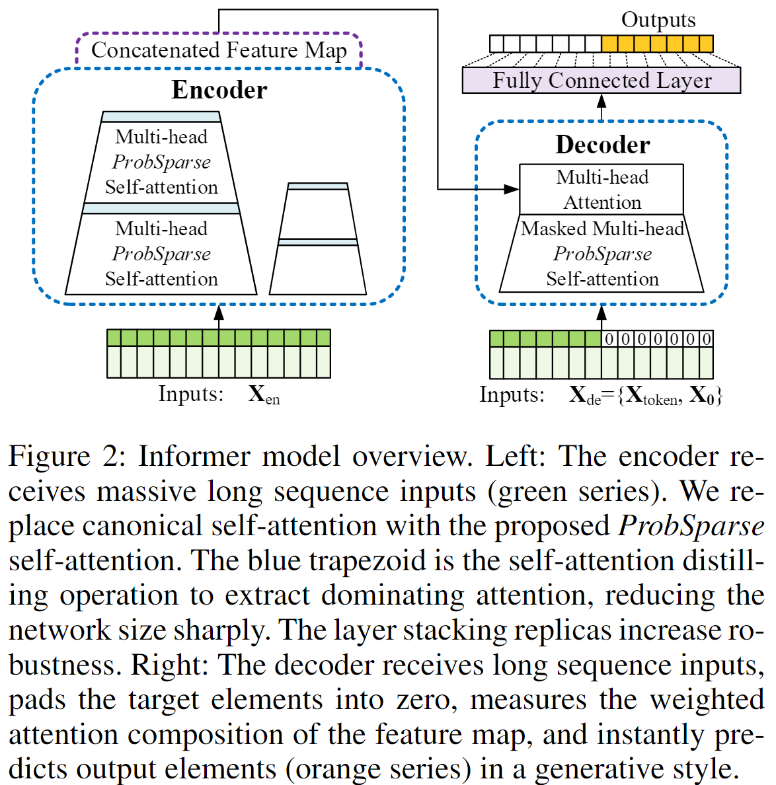

# **Informer: Beyond Efficient Transformer for Long SequenceTime-Series Forecastin**g

## 1. Motivation

&emsp; (1) LSTM对于长时间序列（48个点以上）的预测能力较弱，transfomer在长序列上的效果更好，但是transformer计算量太大。  

&emsp; (2) transformer处理长时间序列的三个显著限制：  

&emsp;&emsp; a) self-attention $L^2$级别时间复杂度；

&emsp;&emsp; b) 堆叠多个encoding-decoding layer对内存消耗大； 

&emsp;&emsp; c) 预测长输出的速度低。

&emsp; (3) 本文的目标是改进transformer模型，提高计算、内存使用的效率，改进模型结构的有效性，提高预测精度。

## 2. Contributions
&emsp; (1) 提出transformer结构的Informer模型，捕捉到时间序列的长期依赖  
&emsp; (2) 提出*ProbSparse* self-attention机制，实现了$O(LlogL)$的时间复杂度和$O(LlogL)$的内存使用
&emsp; (3) 提出self-attention蒸馏算子，减小网络大小
&emsp; (4) 提出生成式的decoder，只需一次前向传播就能获取长序列的输出

## 3. Content
### 3.1 self-attention的表达形式
&emsp; 经典的self-attention可表示为：
$$
\mathcal{A}\rm(Q, K,V) = Softmax(\frac{QK^T}{\sqrt{d}})V
$$
&emsp; the $i$-th query's attention is defined as a kernel smoother in a probability:
$$
\mathcal{A}\rm(q_{\mathcal{i}},K,V) = \sum_\mathcal{j}(\frac{\mathcal{k}(q_\mathcal{i}, k_\mathcal{j})}{\sum_\mathcal{i}(\mathcal{k}(q_\mathcal{i}, k_\mathcal{j}))})V_\mathcal{i}
$$
&emsp; 其中，$\mathcal k \rm(q_{\mathcal i}, k_{\mathcal j}) = e^{\frac{q_{\mathcal i}k_{\mathcal j}^{T}}{\sqrt{d}}}$

###3.2 *ProbSparse* Self-attention
&emsp; (1) 启发： The “sparsity” self-attention score forms a long tail distribution (see Appendix C for details), i.e., a few dot-product pairs contribute to the major attention, andothers generate trivia attention.
&emsp; (2) Define  the $i$-th query's sparsity measurement as:
$$
\mathcal M \rm(q_{\mathcal i}, K) = ln \sum_{\mathcal j=1}^{L} e^{\frac{q_{\mathcal i}k_{\mathcal j}^{T}}{\sqrt{d}}} - \frac{1}{L} \sum_{\mathcal j=1}^{L}\frac{q_{\mathcal i}k_{\mathcal j}^{T}}{\sqrt{d}}
$$

&emsp; (3) 为避免$ln$中的数趋于0，用$\mathcal M$的上确界$\mathcal{\bar M} $替代稀疏性的度量：
$$
\mathcal{\bar M} (\rm q_{\mathcal i}, K) = \max_{\mathcal j}\frac{q_{\mathcal i}k_{\mathcal j}^{T}}{\sqrt{d}} - \frac{1}{L} \sum_{\mathcal j=1}^{L}\frac{q_{\mathcal i}k_{\mathcal j}^{T}}{\sqrt{d}}
$$

&emsp; (4) 随机选取$U = LlnL$个dot-product pairs，计算得到$\mathcal{\bar M}$；选取Top-$u$组成$\bar Q$，得到*ProbSparse* Self-attention 的计算公式：
$$
\mathcal{A}\rm(Q, K,V) = Softmax(\frac{\bar QK^T}{\sqrt{d}})V
$$
&emsp; &emsp; 其中$\bar Q$是稀疏矩阵, $u = c \cdot lnL$。

### 3.3 Model
&emsp; Informer 遵循transformer模型的Encoder-Decoder结构，可以一次性输出预测长序列的全部结果。  

;

#### 3.3.1 Encoder
   

&emsp; (1) 将输入reshape成矩阵的形式，$\rm X_{en}^{\mathcal t} \in \mathcal R^{L \times d} $， 。。。（后续暂时没看懂）